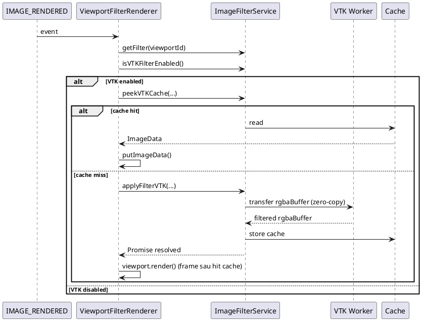

# Báo cáo kỹ thuật VTK Filter

## 1. Mục tiêu công việc
- Xây dựng pipeline lọc ảnh bằng VTK chạy bất đồng bộ để không chặn giao diện.
- Đảm bảo thao tác pan/zoom/scroll mượt khi filter đang xử lý.
- Tận dụng cache để tránh tính toán lặp lại giữa các lần render.
- Tạo một công tắc cấu hình để bật/tắt pipeline VTK theo nhu cầu vận hành.

## 2. Phạm vi báo cáo
Tài liệu này mô tả luồng xử lý VTK đang triển khai trong extension Cornerstone.

## 3. Giải pháp lõi
### 3.1 Hướng tiếp cận
- Lấy dữ liệu pixel từ canvas hiện tại.
- Chuyển buffer sang WebWorker bằng `Comlink transfer` (zero-copy).
- Trong worker, dùng `vtkImageData` làm data container và áp kernel convolution 3x3.
- Trả buffer kết quả về main thread, lưu cache và vẽ lại vào canvas.

### 3.2 Thành phần chính
- `ViewportFilterRenderer`
  - Bắt sự kiện `IMAGE_RENDERED`.
  - Điều phối cache hit/miss và trigger xử lý VTK bất đồng bộ.
- `ImageFilterService`
  - Quản lý trạng thái filter theo viewport.
  - Quản lý worker proxy (`wrap`, `transfer`) và cache kết quả.
  - Cung cấp biến bật/tắt VTK toàn cục:
    - `setVTKFilterEnabled(enabled: boolean)`
    - `isVTKFilterEnabled(): boolean`
- `vtkFilterWorker.js`
  - Chuyển đổi dữ liệu ảnh sang mảng float.
  - Chạy convolution qua `vtkImageData`.
  - Trả RGBA đã lọc cho main thread.

## 4. Sơ đồ luồng xử lý VTK (PlantUML)


## 5. Mã tham khảo chính

### 5.1 Worker: convolution off-thread
File: `extensions/cornerstone/src/workers/vtkFilterWorker.js`

```javascript
const src = new Uint8ClampedArray(rgbaBuffer);

const gray = new Float32Array(W * H);
for (let i = 0; i < W * H; i++) {
  gray[i] = src[i * 4] / 255;
}

const filtered = convolveVTK(gray, W, H, kernel, kernelWeight);

const out = new Uint8ClampedArray(W * H * 4);
for (let i = 0; i < W * H; i++) {
  let v = gray[i] + kernelStrength * (filtered[i] - gray[i]);
  if (v < 0) v = 0;
  if (v > 1) v = 1;
  const byte = (v * 255 + 0.5) | 0;
  const idx = i * 4;
  out[idx] = byte;
  out[idx + 1] = byte;
  out[idx + 2] = byte;
  out[idx + 3] = src[idx + 3];
}

return { rgbaBuffer: out.buffer, canvasWidth: W, canvasHeight: H };
```

### 5.2 Service: transfer + cache + switch VTK
File: `extensions/cornerstone/src/services/ImageFilterService/ImageFilterService.ts`

```typescript
public setVTKFilterEnabled(enabled: boolean): void {
  ImageFilterService.VTK_FILTER_ENABLED = enabled;
  if (!enabled) {
    this._vtkCache.clear();
  }
}

public isVTKFilterEnabled(): boolean {
  return ImageFilterService.VTK_FILTER_ENABLED;
}

const sourceImageData = ctx.getImageData(0, 0, cw, ch);
const result = await proxy.applyFilter(
  transfer(
    {
      rgbaBuffer: sourceImageData.data.buffer,
      canvasWidth: cw,
      canvasHeight: ch,
      kernel: this.kernels[filterType] ?? this.kernels.none,
      kernelWeight: this.kernelWeights[filterType] ?? 0,
      kernelStrength: this.kernelStrengths[filterType] ?? 1.0,
    },
    [sourceImageData.data.buffer]
  )
);
```

### 5.3 Renderer: kiểm tra switch + cache
File: `extensions/cornerstone/src/utils/ViewportFilterRenderer.ts`

```typescript
const vtkEnabled = this.imageFilterService.isVTKFilterEnabled?.() ?? true;
if (!vtkEnabled) {
  return;
}

const cached = this.imageFilterService.peekVTKCache(viewportId, viewport, canvas, filterType);
if (cached) {
  canvas.getContext('2d')?.putImageData(cached, 0, 0);
  return;
}

this.imageFilterService
  .applyFilterVTK(viewportId, viewport, canvas, filterType)
  .then((imageData: ImageData | null) => {
    if (imageData) viewport.render();
  });
```

## 6. Danh sách file liên quan
- `extensions/cornerstone/src/workers/vtkFilterWorker.js`
- `extensions/cornerstone/src/services/ImageFilterService/ImageFilterService.ts`
- `extensions/cornerstone/src/utils/ViewportFilterRenderer.ts`
- `extensions/cornerstone/src/components/WindowLevelActionMenu/ImageFilter.tsx`

## 7. Kết quả đạt được
- Pipeline VTK chạy bất đồng bộ, giảm tải xử lý trên main thread.
- Cơ chế cache giúp giảm xử lý lặp khi re-render.
- Có công tắc bật/tắt VTK để thuận tiện vận hành, demo và kiểm thử.
